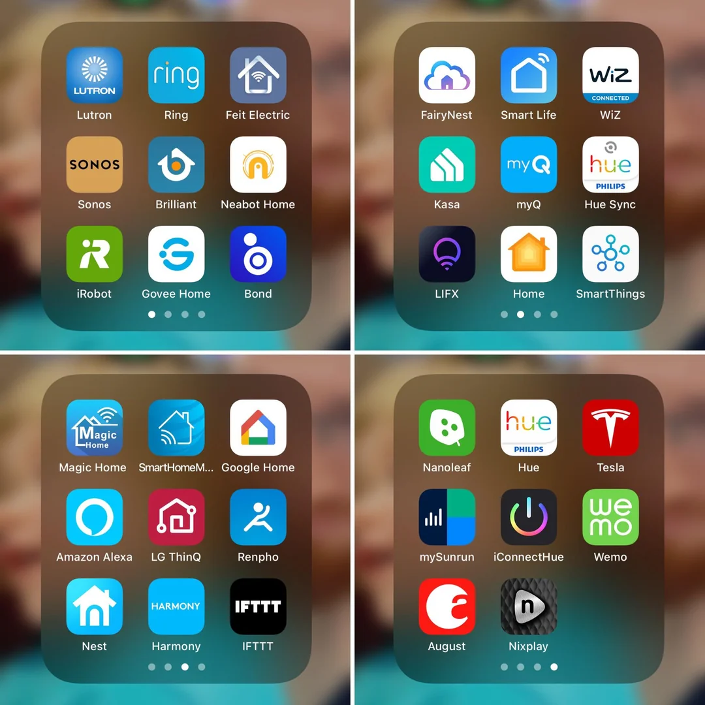
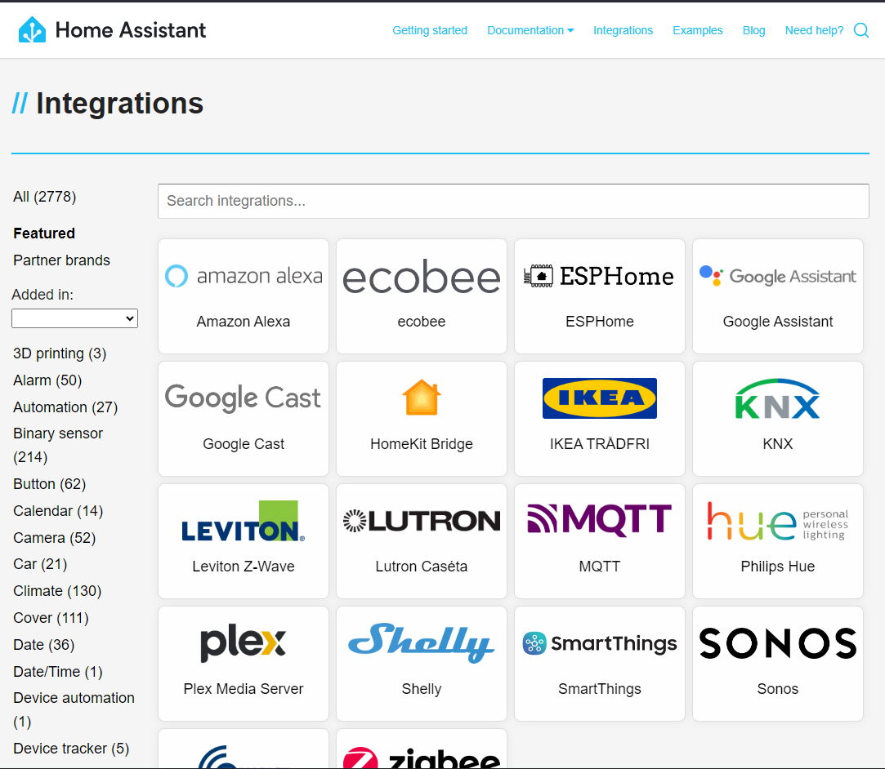
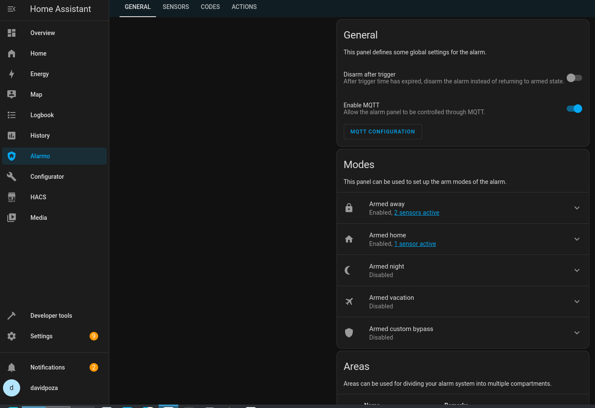
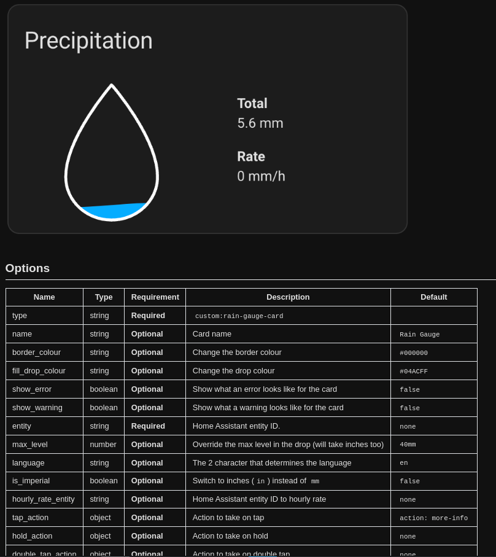

# Qué es Home Assistant
### Y por qué quieres montarte uno

---

# ¿Qué es HA?
Home Assistant es una plataforma de automatización del hogar de código abierto que permite a los usuarios conectar y controlar diversos dispositivos inteligentes en su hogar desde una interfaz centralizada.

Fue desarrollado inicialmente por Paulus Schoutsen en 2013

---
## VENTAJAS
### Es el pegamento que lo une todo

- La principal fortaleza de Home Assistant radica en su capacidad para integrar una multitud de dispositivos de **diferentes marcas y tecnologías**, lo que permite una personalización y automatización avanzada sin depender de un ecosistema cerrado. Home Assistant puede gestionar prácticamente cualquier dispositivo inteligente en una casa (actualmente tiene más de 2700 integraciones).

### Local y privado

- Uno de los aspectos destacados de Home Assistant es su modelo de **privacidad y seguridad**. Al funcionar **localmente**, sin la necesidad de almacenar datos en la nube, los usuarios tienen control total sobre su privacidad y seguridad de su información.
- Cuando se usan tecnologías como esphome o zigbee ya no te expones a que una empresa desaparezca, deje de dar soporte o cambie su modelo de negocio. 

---

### Una aplicación de cada fabricante
Es muy común acabar un número absurdo de apps para el control de dispositivos domóticos.

---
A día de hoy soporta más de 2700 integraciones:

---
## Redes soportadas
### Cada una tiene sus ventajas, las queremos todas
---

| Protocolo         | Frecuencia                                     | Ventajas                                  | Desventajas                                 |
| ----------------- | ---------------------------------------------- | ----------------------------------------- | ------------------------------------------- |
| **Zigbee**        | 2.4 GHz                                        | Red de malla, bajo consumo                | Interferencias con Wi-Fi                    |
| **Z-Wave**        | 800-900 MHz                                    | Red de malla, muy seguro                  | Costo más alto, menos dispositivos          |
| **Wi-Fi**         | 2.4 GHz, 5 GHz                                 | Alta velocidad, infraestructura existente | Consumo alto, puede congestionarse          |
| **Bluetooth/BLE** | 2.4 GHz                                        | Ideal para móviles y wearables            | Alcance y velocidad limitados               |
| **MQTT**          | Depende del transportador (Wi-Fi, etc.)        | Ligero, escalable                         | Requiere configuración de broker            |
| **Thread**        | 2.4 GHz                                        | Sin coordinador central, malla            | No muy extendido                            |
| **RF**            | Variada (comúnmente 433 MHz, 868 MHz, 915 MHz) | Flexible y versátil                       | Seguridad baja, interferencias              |
| **LoRa**          | Variada (comúnmente 433 MHz, 868 MHz, 915 MHz) | Muy largo alcance, bajo consumo           | Velocidad de transmisión baja, más complejo |

---
## Qué coste tiene domotizar tu casa
- Una raspberry pi 3 con 1gb sería suficiente para algo básico (sin procesamiento de video). No recomiendo montarlo en una tarjeta sd.
- Un equipo antiguo con 2 cores y 2GB de ram también sería perfecto
- home assistant green (enchufar y listo - 99$) - soporte zigbee con Home Assistant SkyConnect (dongle)
- home assistant yellow - 150$, se basa en raspberry compute module y ya trae gateway zigbee y permite instalar un m2.
- cámaras: recomendado que soporten rtsp (40€)
- sensores temperatura (3-5€)
- sensores puertas (4-6€)
- relés para iluminación: sonoff o shelly (15-20€)
    - opción diy con esp01s usando esphome (3-5€)
- gateway zigbee: recomiendo sonoff univeral zigbee 3.0 (30€)
- sirena: heiman zigbee 3.0 (40€)
- sensor incendio (33€)
- sensor inundación (10€)

---
### Proyecto open source en plena ebullición

- Liberan una release cada mes, actual: 2024.5.4. 
- Se publican más de 200 cambios semanales. (solo en el core)
- Más de 50 contributors por encima de los 200 commits.  (solo en el core)

Más info:
- REPO: https://github.com/home-assistant
- DOCU: https://www.home-assistant.io/docs/
- DEMO: https://demo.home-assistant.io/
---
### Empresa y suscripción

Desde Septiembre 2018 lo gestiona la empresa Nabu Casa Inc, que se financia enternamente gracias al servicio de subscripción (7.5€).
#### Qué aporta la suscripción?
- integrar Home Assistant con asistentes de voz populares como Amazon Alexa y Google Assistant sin necesidad de configuraciones técnicas complejas
- Control por voz
- Home Assistant Cloud ofrece un acceso remoto seguro sin la necesidad de configurar VPNs o realizar ajustes en el router como el reenvío de puertos y usando https
- Soporte para webhooks
- Contribución al desarrollo
- Backup en la nube
- Soporte dedicado

---

### App nativa

- Puede funcionar como baliza, permite el uso de zonas o la integración con espresense para geolocalización por habitación.
- Habilita el uso de los sensores del dispositivo (por ejemplo el porcentaje de carga o SSID wifi)
- uso de huella para acceder
- Notificaciones (prioridad, TTS, accionables)

---

### HACS

---

### integraciones: por ejemplo: alarmo, frigate
  

---

### frontend: cards
  
---
## Ideas de uso

### Seguridad

### Ahorro energético

### Conveniencia

---

## Seguridad

- Sistema de alarma con NVR (Alarmo + Frigate)
- SImulación de presencia
- alarma incendio  
- alarma inundaciones  
- medir consumo de segunda vivienda como medida de seguridad
- auto cierre cerradura inteligente al salir de casa
- auto armado de alarma  

---

## Ahorro
- Control de electrodomésticos basado en excedente (placas solares)
    - carga coche eléctrico
- Climatización (calefacción / AC) basado en tramos horarios
- pvpc optimizer  
- medir consumo para estimar factura  
- medir consumo por electrodomestico para gestionar gasto  
- riego automático inteligente (no regar si va a llover)
- subir y bajar persianas    

---

## Conveniencia

- Control automático de luces (basado en movimiento, horario, luminosidad, etc.)
- Sistema de taquilla para entrega de paquetes
- escenas (modo noche)  
- sensor nevera  
- aspirador funciona cuando nos vamos
- aspirador programado. con notificación accionable para preguntar si queremos cancelar la limpieza programada
- luz de bienvenida
- notificaciones buzon correos  
- recordatorio lavavarillas y lavadora  
- integrar waze o google maps con trafico y tiempo que se tarda en ir a sitios habituales  
- un informe diario con los valores de ciertos sensores en google home.  
    - temperatura minima durante la noche  
    - temperatura maxima prevista  
    - hora amanecer y anochecer  
    - consumo electrico de ayer  
    - eventos para hoy?  
    - integrar waze o google maps con trafico y tiempo que se tarda en ir a sitios habituales

---

